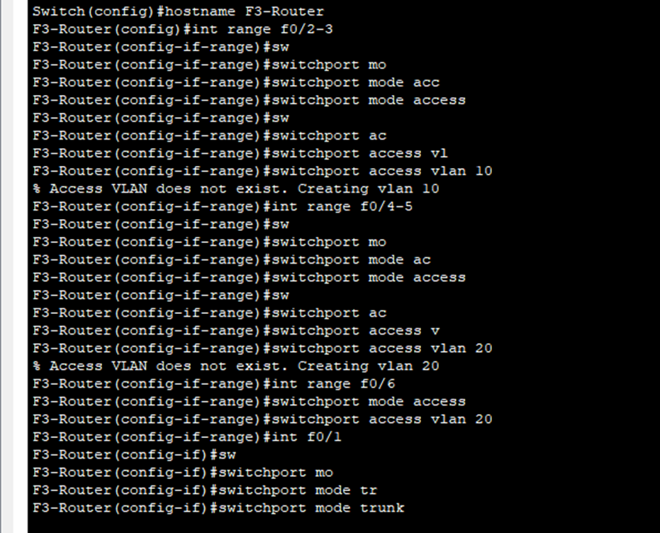
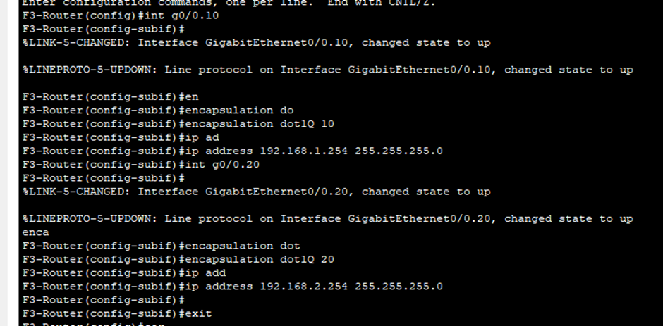
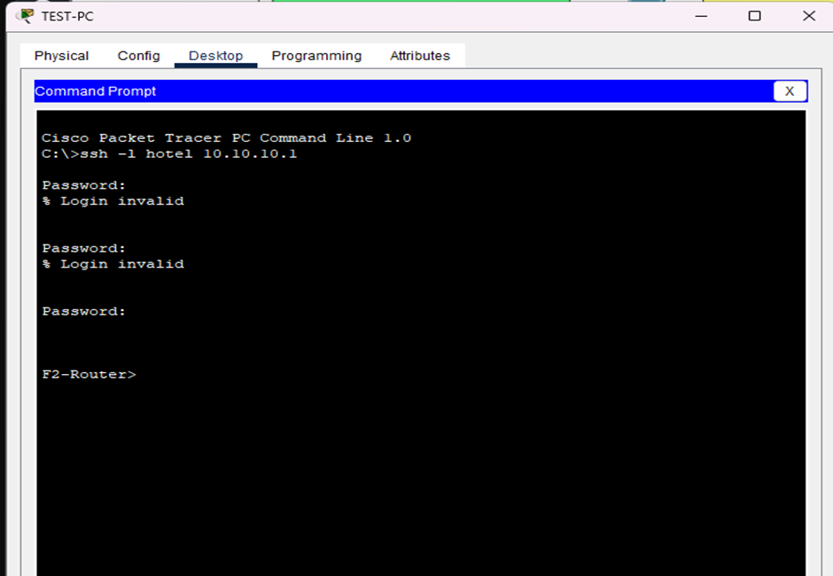

# Hotel Management Implementation in Cisco Packet Tracer

## Table of contents

- [Hotel Management Implementation in Cisco Packet Tracer](#hotel-management-implementation-in-cisco-packet-tracer)
  - [Table of contents](#table-of-contents)
- [Story](#story)
- [Requirement](#requirement)
- [Technologies Implemented](#technologies-implemented)
  - [Step 1: Analyzing the Case Study we’ve been given](#step-1-analyzing-the-case-study-weve-been-given)
  - [Step 2: Configuring Cable for Router](#step-2-configuring-cable-for-router)
  - [Step 3: Adding prerequisite devices](#step-3-adding-prerequisite-devices)
  - [Step 4: Changing the clockrate of the Serial Interface](#step-4-changing-the-clockrate-of-the-serial-interface)
  - [Step 5: Configuring access/trunk port and create VLAN](#step-5-configuring-accesstrunk-port-and-create-vlan)
  - [Step 6: Configuring Subinterface to each Router](#step-6-configuring-subinterface-to-each-router)
    - [Step 6.1: Assign IP Address to each Router interfaces](#step-61-assign-ip-address-to-each-router-interfaces)
    - [Step 6.2: Configure Subinterface](#step-62-configure-subinterface)
  - [Step 7: Configure DHCP](#step-7-configure-dhcp)
  - [Step 8: Configuring OSPF routing in each Router](#step-8-configuring-ospf-routing-in-each-router)
  - [Step 9: Configuring Access Point and Wireless devices](#step-9-configuring-access-point-and-wireless-devices)
  - [Step 10: Configure SSH each router](#step-10-configure-ssh-each-router)
  - [Step 11: Configure port security](#step-11-configure-port-security)

---

# Story

The hotel has three floors; in the first floor there three departments (Reception, store and Logistics), in the second floor there are three departments (Finance, HR and Sales/Marketing), while the third floor hosts the IT and Admin. Therefore, the following are part of the considerations during the design and implementation

# Requirement

1. There should be three routers connecting each floor (all placed in the server room in IT department).
2. All routers should be connected to each other using serial DCE cable.
3. The network between the routers should be 10.10.10.0/30,10.10.10.4/30 and 10.10.10.8/30.
4. Each floor is expected to have one switch (placed in the respective floor).
5. Each floor is expected to have WIFI networks connected to laptops and phones.
6. Each department is expected to have a printer.
7. Each department is expected to be in different VLAN with the following details

| 1st Floor                                     | 2nd Floor                                   | 3rd Floor                                 |
| :--------------------------------------------- | :------------------------------------------ | :---------------------------------------- |
| Reception- VLAN 80, Network of 192.168.8.0/24 | Finance- VLAN 50, Network of 192.168.5.0/24 | Admin- VLAN 20, Network of 192.168.2.0/24 |
| Store- VLAN 70, Network of 192.168.7.0/24     | HR- VLAN 40, Network of 192.168.4.0/24      | IT- VLAN 10, Network of 192.168.1.0/24    |
| Logistics- VLAN 60, Network of 192.168.6.0/24 | Sales- VLAN 30, Network of 192.168.3.0/24   |                                           |

8. Use OSPF as the routing protocol to advertise routes.
9. All devices in the network are expected to obtain IP address dynamically with their respective router configured as the DHCP server.
10. All the devices in the network are expected to communicate with each other.
11. Configure SSH in all the routers for remote login.
12. In IT department, add PC called Test-PC and use it to test remote login.
13. Configure port security to IT-department switch to allow only Test-PC to access port (use sticky method to obtain mac-address with violation mode of shutdown.)

# Technologies Implemented

-   Creating a network topology using Cisco Packet Tracer.
-   Hierarchical Network Design.
-   Connecting Networking devices with Correct cabling.
-   Creating VLANs and assigning ports VLAN numbers.
-   Subnetting and IP Addressing.
-   Configuring Inter-VLAN Routing (Router on a stick).
-   Configuring DHCP Server (Router as the DHCP Server).
-   Configuring SSH for secure Remote access.
-   Configuring switchport security or Port-Security on the switches.
-   Configuring WLAN or wireless network (Cisco Access Point).
-   Host Device Configurations.
-   Test and Verifying Network Communication.

---

## Step 1: Analyzing the Case Study we’ve been given

-   First floor: 3 department(Reception, Logistics, Store)
-   Second floor: 3 department(Finance, HR, Sales/Marketing)
-   Third floor: 2 department(Admin, IT)
-   3 Router connecting each floor
-   All router should be connected to each with Serial Cable DCE
-   Between the network router we should be using 10.10.10.0/30, 10.10.10.4/30 and 10.10.10.8/30.
-   Each floor should have 1 switch(3 switch in total)
-   Each floor should have WIFI connected to laptop and phones(Access point)
-   Each department should have a printer
-   Each department expected to be in different VLAN(We’ve been given VLAN details)
-   Use OSPF as the routing protocol to advertise route(OSPF Routing Protocol)
-   All device in the network are expected to obtain IP dynamically with their respective Router(DHCP Server)
-   Connectivity between all devices are expected to communicate with each other(Inter-VLAN routing)
-   Remote login through SSH(SSH, not Telnet since it’s not very secure)
-   Add a PC called Test-PC use it to test remote login
-   Configure port security to IP department allowing only the Test-PC to access port

---

## Step 2: Configuring Cable for Router


Before adding cable we must configure Serial Port on each Router => Using HWIC-2T Module


---

## Step 3: Adding prerequisite devices


---

## Step 4: Changing the clockrate of the Serial Interface

- If we want them to start using OSPF route, we need to change the clockrate of the Router since it’s using the Serial cable


Use command: show controller [interface] => To check DCE interface so we can change the clock rate of each interface

I've checked Floor 1,2,3 and only Floor 2 and Floor 3 have DCE supported.
In your Network Topology may be different from mine


---

## Step 5: Configuring access/trunk port and create VLAN 




---


## Step 6: Configuring Subinterface to each Router 


### Step 6.1: Assign IP Address to each Router interfaces


### Step 6.2: Configure Subinterface


With this command, I assigned with the last usable IP of each VLAN

```
F1-Router(config)#int g0/0.60
F1-Router(config-subif)#encapsulation dot1Q 60
F1-Router(config-subif)#ip address 192.168.6.254 255.255.255.0
F1-Router(config)#int g0/0.70
F1-Router(config-subif)#encapsulation dot1Q 70
F1-Router(config-subif)#ip address 192.168.7.254 255.255.255.0

F1-Router(config)#int g0/0.80
F1-Router(config-subif)#encapsulation dot1Q 80
F1-Router(config-subif)#ip address 192.168.8.254 255.255.255.0

```


```
F2-Router(config)#int g0/0.30
F2-Router(config-subif)#encapsulation dot1Q 30
F2-Router(config-subif)#ip address 192.168.3.254 255.255.255.0

F2-Router(config-subif)#int g0/0.40
F2-Router(config-subif)#encapsulation dot1Q 40
F2-Router(config-subif)#ip address 192.168.4.254 255.255.255.0

F2-Router(config-subif)#int g0/0.50
F2-Router(config-subif)#encapsulation dot1Q 50
F2-Router(config-subif)#ip address 192.168.5.254 255.255.255.0
```



```
F3-Router(config-subif)#int g0/0.10
F3-Router(config-subif)#encapsulation dot1Q 10
F3-Router(config-subif)#ip address 192.168.1.254 255.255.255.0

F3-Router(config-subif)#int g0/0.20
F3-Router(config-subif)#encapsulation dot1Q 20
F3-Router(config-subif)#ip address 192.168.2.254 255.255.255.0
```

---


## Step 7: Configure DHCP


```
F1-Router(config)#service dhcp
F1-Router(config)#ip dhcp pool Reception
F1-Router(dhcp-config)#network 192.168.8.0 255.255.255.0
F1-Router(dhcp-config)#default-router 192.168.8.254
F1-Router(dhcp-config)#dns-server 192.168.8.254
F1-Router(dhcp-config)#exit
F1-Router(config)#ip dhcp pool Store
F1-Router(dhcp-config)#network 192.168.7.0 255.255.255.0
F1-Router(dhcp-config)#default-router 192.168.7.254
F1-Router(dhcp-config)#dns-server 192.168.7.254
F1-Router(dhcp-config)#exit
F1-Router(config)#ip dhcp pool Logistics
F1-Router(dhcp-config)#network 192.168.6.0 255.255.255.0
F1-Router(dhcp-config)#default-router 192.168.6.254
F1-Router(dhcp-config)#dns-server 192.168.6.254
```


```
F2-Router(config)#service dhcp
F2-Router(config)#ip dhcp pool Sale
F2-Router(dhcp-config)#network 192.168.3.0 255.255.255.0
F2-Router(dhcp-config)#default-router 192.168.3.254
F2-Router(dhcp-config)#dns-server 192.168.3.254
F2-Router(config)#service dhcp
F2-Router(config)#ip dhcp pool HR
F2-Router(dhcp-config)#network 192.168.4.0 255.255.255.0
F2-Router(dhcp-config)#default-router 192.168.4.254
F2-Router(dhcp-config)#dns-server 192.168.4.254
F2-Router(config)#service dhcp
F2-Router(config)#ip dhcp pool Finance
F2-Router(dhcp-config)#network 192.168.5.0 255.255.255.0
F2-Router(dhcp-config)#default-router 192.168.5.254
F2-Router(dhcp-config)#dns-server 192.168.5.254
```


```
F3-Router(config)#ip dhcp pool IT
F3-Router(dhcp-config)#network 192.168.1.0 255.255.255.0
F3-Router(dhcp-config)#default-router 192.168.1.254
F3-Router(dhcp-config)#dns-server 192.168.1.254
F3-Router(config)#ip dhcp pool Admin
F3-Router(dhcp-config)#network 192.168.2.0 255.255.255.0
F3-Router(dhcp-config)#default-router 192.168.2.254
F3-Router(dhcp-config)#dns-server 192.168.2.254
```
---


## Step 8: Configuring OSPF routing in each Router


```
F1-Router(config)#router ospf 10
F1-Router(config-router)#network 10.10.10.4 0.0.0.3 area 0
F1-Router(config-router)#network 10.10.10.8 0.0.0.3 area 0
F1-Router(config-router)#network 192.168.8.0 0.0.0.255 area 0
F1-Router(config-router)#network 192.168.7.0 0.0.0.255 area 0
F1-Router(config-router)#network 192.168.6.0 0.0.0.255 area 0
```


```
F2-Router(config)#router ospf 10
F2-Router(config-router)#network 10.10.10.0 0.0.0.3 area 0
F2-Router(config-router)#network 10.10.10.8 0.0.0.3 area 0
F2-Router(config-router)#network 192.168.3.0 0.0.0.255 area 0
F2-Router(config-router)#network 192.168.4.0 0.0.0.255 area 0
F2-Router(config-router)#network 192.168.5.0 0.0.0.255 area 0
```


```
F3-Router(config)#router ospf 10
F3-Router(config-router)#network 10.10.10.0 0.0.0.3 area 0
F3-Router(config-router)#network 10.10.10.4 0.0.0.3 area 0
F3-Router(config-router)#network 192.168.1.0 0.0.0.255 area 0
F3-Router(config-router)#network 192.168.2.0 0.0.0.255 area 0
```

---

## Step 9: Configuring Access Point and Wireless devices

- We will try to test out Wireless connection

- I added multiple Wireless device and setup SSID and Password for access point in each Floor


[You can checkout my this project to see how Access Point and Access Devices is configured link](https://github.com/minhkhang0122/SOHO)

---

## Step 10: Configure SSH each router


- Before configuring SSH we must configure hostname of device and domain name

- Configure username and password sine SSH require authentication

- Choosing 1024 module is it will use SSHv2

```
F3-Router(config)#ip domain-name [domain-name]
F3-Router(config)#username [username] password [password]
F3-Router(config)#crypto key generate rsa
F3-Router(config)#line vty 0 15
F3-Router(config-line)#login local
F3-Router(config-line)#transport input ssh
```


- Accessing Second Floor Router and First Floor Router with [username] as the user we configured
Window command: ssh -l [username] [IP of the Router]



---

## Step 11: Configure port security


